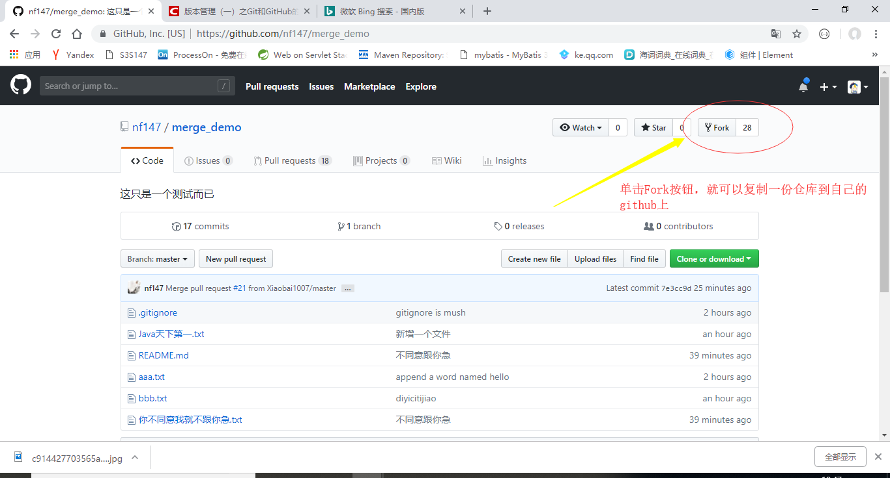
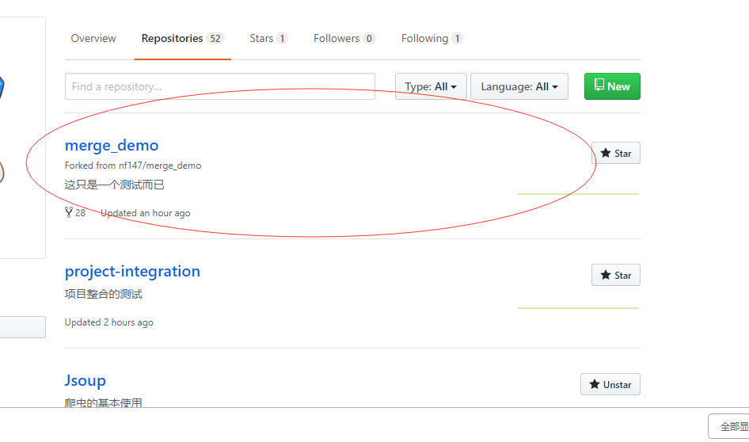
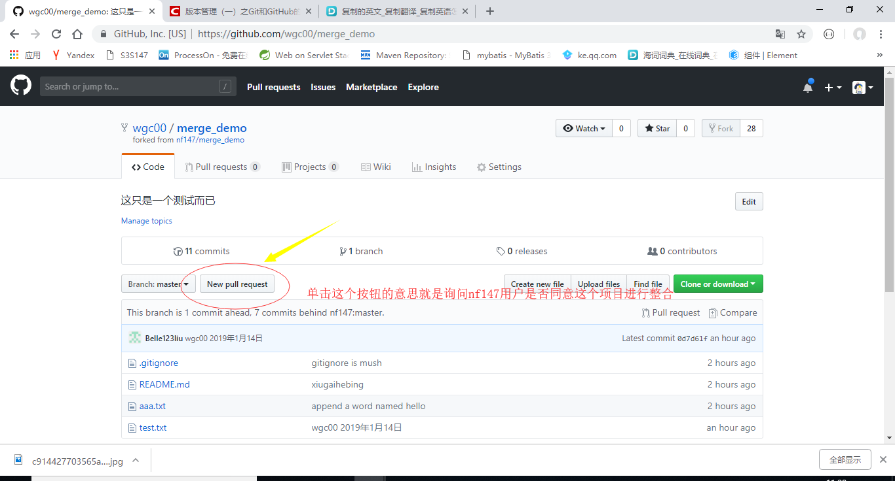

# project-integration
项目整合的测试

## 传统的github整合项目

- 在本地的磁盘克隆两份项目
- 提交时的步骤：
				1、git status(先查看) 
				2、git add . 
				3、git commit(加上日期) 
				4、git pull（更新） 
				5、git push
- 如果在第五步出错时，可能需要我们手动去解决问题
- 优点：
- 缺点：提交项目的人都要有和创建者一样的权限

## 现在的方式整合项目+传统
- 首先我们要去分支一个项目，进去一个项目点击右上角的Fork   

   

- 自己的github  

  

- 其次，自己可以把项目克隆下来，进行代码的修改了  
- 当我们项目提交项目时，就安装上述提交时的步骤  
- 最后，如果我们要把自己的merge——demo项目整合到nf147用户的merge_demo项目中，  
- 在自己的merge_demo项目中单击New pull request按钮就可以了  

  